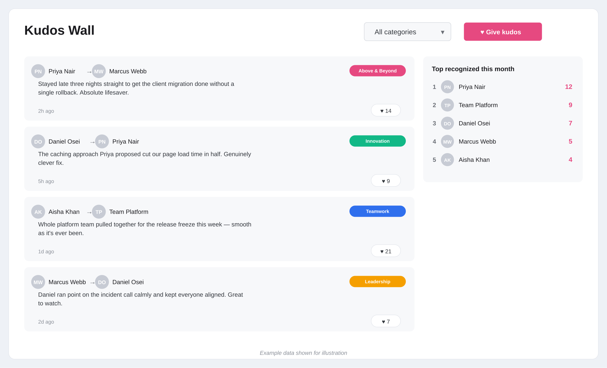

<p align="center">
  
</p>

<h1 align="center">SPFx Kudos Wall</h1>

<p align="center">
  A SharePoint Framework web part for peer-to-peer recognition — a live feed of shoutouts,
  category badges, reactions, and a monthly leaderboard, all backed by a single SharePoint list.
</p>


## Preview



*Shown with mock data for illustration — live data is pulled from the SharePoint list you configure.*

## Why this exists

Recognition programs usually live in a separate tool, a Teams channel that scrolls away, or an
email chain nobody re-reads. This web part puts it directly on the intranet home page: post a
shoutout, tag who it's for, react to others, and see who's been recognized most this month —
without leaving SharePoint.

## Features

- **Recognition feed** — giver → receiver, category badge, message, relative timestamp.
- **People Picker integration** — pick the recipient from the tenant directory, no typing names.
- **Categories** — Teamwork, Innovation, Leadership, Above & Beyond (color-coded badges).
- **Reactions** — one click to applaud a post; optimistic UI update with rollback on failure.
- **Monthly leaderboard** — top recognized people this calendar month, ranked automatically.
- **Category filter** — scope the feed to a single category.
- **Fully permission-aware** — reads and writes through the current user's own SharePoint session (`SPHttpClient`); never bypasses list permissions.
- **No-code configuration** — list name, wall title, and leaderboard size are all set from the property pane.

## How it's built

- **Framework:** SharePoint Framework (SPFx) 1.23, React, TypeScript
- **Build system:** Heft
- **UI:** Fluent UI (`@fluentui/react`)
- **People Picker:** `@pnp/spfx-controls-react`
- **Data access:** `SPHttpClient` against `_api/web/lists/getbytitle(...)/items`, with pagination handling and digest-based writes

## Required list schema

Create a SharePoint list (any name — you set it in the property pane) with these columns:

| Column | Type | Notes |
|---|---|---|
| Title | Single line of text | Auto-filled as `Giver → Receiver` |
| Message | Multiple lines of text | The kudos message |
| Category | Single line of text | One of: Teamwork, Innovation, Leadership, Above & Beyond |
| GiverName | Single line of text | Display name of the person giving kudos |
| ReceiverName | Single line of text | Display name of the person receiving kudos |
| Reactions | Number | Defaults to 0, incremented on each 👏 click |

## Configuration

| Setting | What it does |
|---|---|
| Wall title | Heading shown above the feed |
| SharePoint list name | Exact title of the source list |
| Show leaderboard | Toggle the sidebar leaderboard on/off |
| Leaderboard size | How many top-recognized people to show (3–10) |

## Getting started (development)

```bash
npm install
npm run serve
```

This opens the local SPFx workbench for development. To package for deployment:

```bash
npm run build
gulp bundle --ship
gulp package-solution --ship
```

This produces a `.sppkg` package under `sharepoint/solution/`, ready to upload to a SharePoint App Catalog and deploy to any site in a tenant.

## Disclaimer

Provided as-is, without warranty of any kind.
